<!-- ████████████████████████████████████████████████████████████████████████████████ -->
<!-- ██                    RAMIT SAKHUJA — GITHUB PROFILE README                  ██ -->
<!-- ████████████████████████████████████████████████████████████████████████████████ -->

  
<!-- ═══════════════════════════════════════════════════════ -->
<!--                    ANIMATED BANNER                     -->
<!-- ═══════════════════════════════════════════════════════ -->

<!-- ═══════════════════════════════════════════════════════ -->
<!--                   TYPING ANIMATION                     -->
<!-- ═══════════════════════════════════════════════════════ -->

 

<!-- ═══════════════════════════════════════════════════════════════════════════════ -->
<!--                          ABOUT ME — THE BRIEF                                 -->
<!-- ═══════════════════════════════════════════════════════════════════════════════ -->

<table align="center" border="0">
<tr>
<td width="55%" valign="top">

### 🧠 &nbsp;The Human Behind the Data

Hey there! I'm **Ramit Sakhuja** — a **B.Tech CSE (AI & ML)** student at **G.L. Bajaj Institute of Technology and Management, Greater Noida**, on a mission to become a world-class **Data Analyst**. I live at the intersection of SQL, Python, and visual storytelling, building data products that don't just answer questions — they spark better ones.

I believe dashboards should be as beautiful as they are insightful, and that the best analysis is one that a non-technical stakeholder can understand in 30 seconds flat.

When I'm not wrangling datasets, I'm obsessing over Power BI design, clean SQL logic, and building projects that actually solve real-world problems.

**🔭 Currently:** Building end-to-end analytics projects  
**🌱 Learning:** Advanced SQL, Scikit-learn, Feature Engineering  
**💡 Superpower:** Making complex data feel simple  
**⚡ Fun Fact:** I think in pivot tables  

</td>
<td width="45%" align="center" valign="middle">

</td>
</tr>
</table>

 

<!-- ═══════════════════════════════════════════════════════ -->
<!--                     DIVIDER                           -->
<!-- ═══════════════════════════════════════════════════════ -->

 

<!-- ═══════════════════════════════════════════════════════════════════════════════ -->
<!--                          SKILLS SECTION                                        -->
<!-- ═══════════════════════════════════════════════════════════════════════════════ -->

## 🛠 &nbsp;Tech Arsenal

*The tools I use to transform raw data into business gold*

 

**👨‍💻 &nbsp;Programming Languages**

 

**📊 &nbsp;Data Analysis & Processing**

 

**📈 &nbsp;Data Visualization & BI**

 

**🤖 &nbsp;Machine Learning**

 

**🧰 &nbsp;Tools & Environment**

 

 

<!-- ═══════════════════════════════════════════════════════════════════════════════ -->
<!--                    FROM RAW DATA TO BUSINESS IMPACT                            -->
<!-- ═══════════════════════════════════════════════════════════════════════════════ -->

## 🔄 &nbsp;From Raw Data to Business Impact

*My end-to-end analytics workflow*

```mermaid
flowchart LR
    A[🗄️ Raw Data] --> B[🧹 Clean & Transform]
    B --> C[🔍 Explore & Analyze]
    C --> D[🤖 Model & Predict]
    D --> E[📊 Visualize & Report]
    E --> F[💡 Business Decision]
    F --> G[📈 Measurable Impact]

    style A fill:#1a1a2e,stroke:#6E96F7,color:#fff
    style B fill:#1a1a2e,stroke:#A78BFA,color:#fff
    style C fill:#1a1a2e,stroke:#34D399,color:#fff
    style D fill:#1a1a2e,stroke:#F59E0B,color:#fff
    style E fill:#1a1a2e,stroke:#EC4899,color:#fff
    style F fill:#1a1a2e,stroke:#6E96F7,color:#fff
    style G fill:#1a1a2e,stroke:#34D399,color:#fff
```

 

 

 

<!-- ═══════════════════════════════════════════════════════════════════════════════ -->
<!--                          CODING QUOTE                                          -->
<!-- ═══════════════════════════════════════════════════════════════════════════════ -->

## 💬 &nbsp;Data Wisdom

 

> *"Without data, you're just another person with an opinion."*  
> — W. Edwards Deming

 

