<!-- ████████████████████████████████████████████████████████████████████████████████ -->
<!-- ██                    RAMIT SAKHUJA — GITHUB PROFILE README                  ██ -->
<!-- ████████████████████████████████████████████████████████████████████████████████ -->

<div align="center">

<!-- ═══════════════════════════════════════════════════════ -->
<!--                    ANIMATED BANNER                     -->
<!-- ═══════════════════════════════════════════════════════ -->


<!-- ═══════════════════════════════════════════════════════ -->
<!--                   TYPING ANIMATION                     -->
<!-- ═══════════════════════════════════════════════════════ -->

<a href="https://git.io/typing-svg">
  
</a>

<br/>

<!-- ═══════════════════════════════════════════════════════ -->
<!--                   PROFILE VIEWS                        -->
<!-- ═══════════════════════════════════════════════════════ -->


&nbsp;

&nbsp;
<a href="https://linkedin.com/in/ramitsakhuja">
  
</a>
&nbsp;


</div>

<br/>

<!-- ═══════════════════════════════════════════════════════════════════════════════ -->
<!--                          ABOUT ME — THE BRIEF                                 -->
<!-- ═══════════════════════════════════════════════════════════════════════════════ -->

<div align="center">

```
╔══════════════════════════════════════════════════════════════════════╗
║                                                                      ║
║   "I don't just analyze data — I decode patterns, craft narratives,  ║
║    and turn numbers into strategy that drives real decisions."        ║
║                                                                      ║
║                                              — Ramit Sakhuja         ║
╚══════════════════════════════════════════════════════════════════════╝
```

</div>

<br/>

<table align="center" border="0">
<tr>
<td width="55%" valign="top">

### 🧠 &nbsp;The Human Behind the Data

Hey there! I'm **Ramit Sakhuja** — a final-year **Computer Science (AI & ML)** student on a mission to become a world-class **Data Analyst**. I live at the intersection of code, statistics, and design, building data products that don't just answer questions — they spark better ones.

I believe dashboards should be as beautiful as they are insightful, and that the best analysis is one that a non-technical stakeholder can understand in 30 seconds flat.

When I'm not wrangling datasets, I'm obsessing over visual storytelling, clean design, and building projects that actually solve real-world problems.

**🔭 Currently:** Building data pipelines & ML models  
**🌱 Learning:** Advanced SQL, dbt, Cloud Analytics  
**💡 Superpower:** Making complex data feel simple  
**⚡ Fun Fact:** I think in pivot tables  

</td>
<td width="45%" align="center" valign="middle">


</td>
</tr>
</table>

<br/>

<!-- ═══════════════════════════════════════════════════════ -->
<!--                     DIVIDER                           -->
<!-- ═══════════════════════════════════════════════════════ -->


<br/>

<!-- ═══════════════════════════════════════════════════════════════════════════════ -->
<!--                          CURRENTLY BUILDING                                   -->
<!-- ═══════════════════════════════════════════════════════════════════════════════ -->

<div align="center">

## 🔨 &nbsp;Currently Building

</div>

<div align="center">

<table border="0">
<tr>
<td align="center" width="33%">

**🧩 &nbsp;Churn Predictor v2.0**  
Upgrading my retention system with real-time scoring  
`XGBoost` · `FastAPI` · `Streamlit`

</td>
<td align="center" width="33%">

**📊 &nbsp;HR Analytics Suite**  
360° workforce intelligence platform  
`SQL` · `Power BI` · `DAX`

</td>
<td align="center" width="33%">

**🎯 &nbsp;OTT Engagement Engine**  
Binge-pattern analysis for streaming platforms  
`Python` · `SQL` · `Power BI`

</td>
</tr>
</table>

</div>

<br/>


<br/>

<!-- ═══════════════════════════════════════════════════════════════════════════════ -->
<!--                          SKILLS SECTION                                        -->
<!-- ═══════════════════════════════════════════════════════════════════════════════ -->

<div align="center">

## 🛠 &nbsp;Tech Arsenal

*The tools I use to transform raw data into business gold*

</div>

<br/>

<div align="center">

**👨‍💻 &nbsp;Programming Languages**


<br/>

**📊 &nbsp;Data Analysis & Processing**


<br/>

**📈 &nbsp;Data Visualization & BI**


<br/>

**🤖 &nbsp;Machine Learning & AI**


<br/>

**🧰 &nbsp;Tools & Environment**


</div>

<br/>


<br/>

<!-- ═══════════════════════════════════════════════════════════════════════════════ -->
<!--                         FEATURED PROJECTS                                      -->
<!-- ═══════════════════════════════════════════════════════════════════════════════ -->

<div align="center">

## 🚀 &nbsp;Featured Case Studies

*Not just projects. Real problems. Real impact.*

</div>

<br/>

---

<!-- ─── PROJECT 01 ─────────────────────────────────────────────────────────────── -->

<table border="0">
<tr>
<td width="6%" valign="top" align="center">
  <br/>
  
</td>
<td width="94%">

### 🧠 &nbsp;Customer Retention Intelligence System

> *"Predicting churn before it costs the business — with 91% accuracy."*

<br/>

**The Problem:** E-commerce businesses lose millions annually to undetected customer churn. Traditional CRM systems react after the fact — too late and too expensive.

**The Solution:** An end-to-end intelligent retention platform that identifies at-risk customers *before* they leave, enabling proactive intervention with personalized offers.

<br/>

<table border="0">
<tr>
<td width="50%">

**📌 &nbsp;What I Built**
- Engineered 40+ behavioral & transactional features from raw logs
- Trained XGBoost model achieving **91% AUC-ROC**
- Built real-time scoring API with sub-100ms latency
- Deployed interactive Streamlit app for business teams
- Created Looker Studio dashboard for retention KPIs

</td>
<td width="50%">

**💡 &nbsp;Key Business Insights**
- Identified top 3 churn predictors: recency, frequency, support tickets
- Flagged **23% of customer base** as high-risk in first run
- Modeled potential **$340K annual retention uplift**
- Segment-level churn rates ranged from 4% to 67%
- Early intervention window: **21 days before likely churn**

</td>
</tr>
</table>

<br/>

**🛠 &nbsp;Tech Stack:**


<br/>

<a href="#">
  
</a>
&nbsp;
<a href="#">
  
</a>
&nbsp;
<a href="#">
  
</a>

</td>
</tr>
</table>

<br/>

---

<!-- ─── PROJECT 02 ─────────────────────────────────────────────────────────────── -->

<table border="0">
<tr>
<td width="6%" valign="top" align="center">
  <br/>
  
</td>
<td width="94%">

### 📊 &nbsp;Employee Attrition & Workforce Analytics Dashboard

> *"Because your most expensive hire is the one who just left — and you didn't see it coming."*

<br/>

**The Problem:** HR teams at mid-to-large companies struggle to identify flight risk employees until they've already resigned. Exit interviews are too late; intuition isn't scalable.

**The Solution:** A comprehensive Power BI analytics suite that surfaces attrition patterns, identifies at-risk departments, and gives HR leadership a strategic retention playbook.

<br/>

<table border="0">
<tr>
<td width="50%">

**📌 &nbsp;What I Built**
- Cleaned & modeled IBM HR Analytics dataset (1,470 records)
- Built a 6-page interactive Power BI report with drill-throughs
- Designed custom DAX measures for attrition segmentation
- Created salary vs. satisfaction correlation matrix
- Department-level attrition heatmap with YoY comparison

</td>
<td width="50%">

**💡 &nbsp;Key Business Insights**
- Overall attrition rate: **16.1%** — 2× industry benchmark
- Sales department showed **highest 3-year attrition spike**
- Employees with <2 years tenure = **40% of total exits**
- Overtime workers churned at **3.4× the rate** of others
- Low job satisfaction scores predicted exits 6 months early

</td>
</tr>
</table>

<br/>

**🛠 &nbsp;Tech Stack:**


<br/>

<a href="#">
  
</a>
&nbsp;
<a href="#">
  
</a>

</td>
</tr>
</table>

<br/>

---

<!-- ─── PROJECT 03 ─────────────────────────────────────────────────────────────── -->

<table border="0">
<tr>
<td width="6%" valign="top" align="center">
  <br/>
  
</td>
<td width="94%">

### 🎬 &nbsp;OTT Viewer Retention & Engagement Analytics

> *"Netflix doesn't guess who'll cancel next. Neither should you."*

<br/>

**The Problem:** OTT platforms face massive subscriber churn in a hyper-competitive market. Without data-driven engagement analysis, content investments and retention budgets are wasted.

**The Solution:** A full-stack SQL + Power BI analytics platform that dissects viewer behavior, content engagement, and cancellation triggers to drive data-informed content & UX strategy.

<br/>

<table border="0">
<tr>
<td width="50%">

**📌 &nbsp;What I Built**
- Wrote 25+ complex SQL queries across a multi-table schema
- Segmented users by watch-time, genre preference & device
- Built Power BI report with content-level engagement scoring
- Created cohort retention curves using SQL window functions
- Designed binge behavior heatmap across day/time slots

</td>
<td width="50%">

**💡 &nbsp;Key Business Insights**
- Viewers completing >70% of content had **5× lower churn**
- Mobile-first users showed **2.1× higher early churn** rate
- Content drop-off peak: **Episode 3 of new series**
- Weekend evening = **highest engagement slot** (8–11 PM)
- Personalized recommendation CTR correlated with 30-day retention

</td>
</tr>
</table>

<br/>

**🛠 &nbsp;Tech Stack:**


<br/>

<a href="#">
  
</a>
&nbsp;
<a href="#">
  
</a>

</td>
</tr>
</table>

<br/>


<br/>

<!-- ═══════════════════════════════════════════════════════════════════════════════ -->
<!--                    FROM RAW DATA TO BUSINESS IMPACT                            -->
<!-- ═══════════════════════════════════════════════════════════════════════════════ -->

<div align="center">

## 🔄 &nbsp;From Raw Data to Business Impact

*My end-to-end analytics workflow*

```mermaid
flowchart LR
    A[🗄️ Raw Data] --> B[🧹 Clean & Transform]
    B --> C[🔍 Explore & Analyze]
    C --> D[🤖 Model & Predict]
    D --> E[📊 Visualize & Report]
    E --> F[💡 Business Decision]
    F --> G[📈 Measurable Impact]

    style A fill:#1a1a2e,stroke:#6E96F7,color:#fff
    style B fill:#1a1a2e,stroke:#A78BFA,color:#fff
    style C fill:#1a1a2e,stroke:#34D399,color:#fff
    style D fill:#1a1a2e,stroke:#F59E0B,color:#fff
    style E fill:#1a1a2e,stroke:#EC4899,color:#fff
    style F fill:#1a1a2e,stroke:#6E96F7,color:#fff
    style G fill:#1a1a2e,stroke:#34D399,color:#fff
```

</div>

<br/>

<div align="center">



</div>

<br/>


<br/>

<!-- ═══════════════════════════════════════════════════════════════════════════════ -->
<!--                          GITHUB STATISTICS                                     -->
<!-- ═══════════════════════════════════════════════════════════════════════════════ -->

<div align="center">

## 📊 &nbsp;GitHub Analytics

</div>

<br/>

<div align="center">


<br/><br/>


</div>

<br/>

<!-- ═══════════════════════════════════════════════════════════════════════════════ -->
<!--                          GITHUB TROPHIES                                       -->
<!-- ═══════════════════════════════════════════════════════════════════════════════ -->

<div align="center">

## 🏆 &nbsp;GitHub Trophies


</div>

<br/>

<!-- ═══════════════════════════════════════════════════════════════════════════════ -->
<!--                          ACTIVITY GRAPH                                        -->
<!-- ═══════════════════════════════════════════════════════════════════════════════ -->

<div align="center">

## 📈 &nbsp;Contribution Activity


</div>

<br/>

<!-- ═══════════════════════════════════════════════════════════════════════════════ -->
<!--                       CONTRIBUTION SNAKE                                       -->
<!-- ═══════════════════════════════════════════════════════════════════════════════ -->

<div align="center">

## 🐍 &nbsp;Contributions Snake

<picture>
  <source media="(prefers-color-scheme: dark)" srcset="https://raw.githubusercontent.com/ramitsakhuja/ramitsakhuja/output/github-contribution-grid-snake-dark.svg">
  <source media="(prefers-color-scheme: light)" srcset="https://raw.githubusercontent.com/ramitsakhuja/ramitsakhuja/output/github-contribution-grid-snake.svg">
  
</picture>

</div>

<br/>


<br/>

<!-- ═══════════════════════════════════════════════════════════════════════════════ -->
<!--                          ANALYTICS JOURNEY                                     -->
<!-- ═══════════════════════════════════════════════════════════════════════════════ -->

<div align="center">

## 📅 &nbsp;Analytics Journey

</div>

<br/>

<div align="center">

<table border="0">
<tr>
<td align="center" valign="top" width="25%">

**🌱 2022**  
*The Spark*

Started CS with AI & ML  
First Python script  
Fell in love with data  
"Why does this CSV have 47 columns?"

</td>
<td align="center" valign="top" width="25%">

**⚡ 2023**  
*The Grind*

Mastered SQL fundamentals  
Built first Power BI dashboard  
Learned Pandas deeply  
"So pivot tables work in code too?"

</td>
<td align="center" valign="top" width="25%">

**🚀 2024**  
*The Leap*

Built ML-powered churn model  
Shipped 3 end-to-end projects  
Discovered DAX & advanced SQL  
"I can actually predict the future?"

</td>
<td align="center" valign="top" width="25%">

**🎯 2025–26**  
*The Target*

Land dream Data Analyst role  
Contribute to open-source tools  
Publish analytics case studies  
"Let's turn insight into impact."

</td>
</tr>
</table>

</div>

<br/>


<br/>

<!-- ═══════════════════════════════════════════════════════════════════════════════ -->
<!--                       WHAT I'M LEARNING                                        -->
<!-- ═══════════════════════════════════════════════════════════════════════════════ -->

<div align="center">

## 📚 &nbsp;What I'm Currently Learning

</div>

<br/>

<div align="center">

<table border="0">
<tr>
<td align="center" width="20%">

**☁️**  
**Google BigQuery**  
Cloud-scale SQL  
`In Progress`

</td>
<td align="center" width="20%">

**🔧**  
**dbt (Data Build Tool)**  
Analytics engineering  
`Just Started`

</td>
<td align="center" width="20%">

**🐍**  
**Advanced Python**  
OOP for data pipelines  
`Ongoing`

</td>
<td align="center" width="20%">

**📊**  
**Tableau**  
Premium viz layer  
`Exploring`

</td>
<td align="center" width="20%">

**🤖**  
**LLM APIs for Analytics**  
AI-powered reporting  
`Experimenting`

</td>
</tr>
</table>

</div>

<br/>


<br/>

<!-- ═══════════════════════════════════════════════════════════════════════════════ -->
<!--                            GOALS FOR 2026                                      -->
<!-- ═══════════════════════════════════════════════════════════════════════════════ -->

<div align="center">

## 🎯 &nbsp;Goals for 2026

</div>

<br/>

<div align="center">

| # | Goal | Status |
|---|------|--------|
| 🎓 | Graduate with distinction in CS (AI & ML) | 🟡 In Progress |
| 💼 | Land a Data Analyst role at a product/tech company | 🟡 Targeting |
| 📦 | Ship 2 more end-to-end analytics projects | 🟡 Building |
| 🏅 | Earn Google Data Analytics Professional Certificate | 🟡 Enrolled |
| ☁️ | Complete cloud analytics certification (GCP/Azure) | 🔵 Planned |
| ✍️ | Publish 3 data case studies on Medium/LinkedIn | 🔵 Planned |
| 🤝 | Contribute to open-source data tools | 🔵 Planned |
| 📈 | Reach 500+ LinkedIn followers through content | 🟡 Growing |

</div>

<br/>


<br/>

<!-- ═══════════════════════════════════════════════════════════════════════════════ -->
<!--                              FUN FACTS                                         -->
<!-- ═══════════════════════════════════════════════════════════════════════════════ -->

<div align="center">

## ⚡ &nbsp;Fun Facts About Me

</div>

<br/>

<div align="center">

```yaml
ramit_sakhuja:
  personality:
    - "I genuinely get excited when a SQL query optimizes itself 🚀"
    - "I've debugged dashboards at 2AM and called it 'fun' 🌙"
    - "My Excel sheets have better design than most presentations 📊"
    - "I see KPIs in everyday situations (gym progress? That's a time-series) 💪"
    - "I once spent 4 hours making a Power BI report 'perfect' for a 2-minute meeting"

  unpopular_opinions:
    - "Excel is underrated. Fight me."
    - "A beautiful dashboard is worth 1,000 data points"
    - "The best model is the one stakeholders can understand"

  currently_listening_to: "Lo-fi beats while writing SQL 🎧"
  coffee_consumed_today: "Enough to power a Jupyter kernel ☕"
  tabs_open_right_now: "Way too many Stack Overflow queries 📖"
```

</div>

<br/>


<br/>

<!-- ═══════════════════════════════════════════════════════════════════════════════ -->
<!--                          CODING QUOTE                                          -->
<!-- ═══════════════════════════════════════════════════════════════════════════════ -->

<div align="center">

## 💬 &nbsp;Data Wisdom

<br/>

> *"Without data, you're just another person with an opinion."*  
> — W. Edwards Deming

<br/>


</div>

<br/>


<br/>

<!-- ═══════════════════════════════════════════════════════════════════════════════ -->
<!--                           CONNECT WITH ME                                      -->
<!-- ═══════════════════════════════════════════════════════════════════════════════ -->

<div align="center">

## 🤝 &nbsp;Let's Connect

*Open to internships, collaborations, data conversations, and everything in between.*

<br/>

<a href="https://linkedin.com/in/ramitsakhuja">
  
</a>
&nbsp;
<a href="mailto:ramit.sakhuja@email.com">
  
</a>
&nbsp;
<a href="#">
  
</a>
&nbsp;
<a href="#">
  
</a>
&nbsp;
<a href="https://kaggle.com/ramitsakhuja">
  
</a>
&nbsp;
<a href="https://medium.com/@ramitsakhuja">
  
</a>

<br/><br/>


</div>
